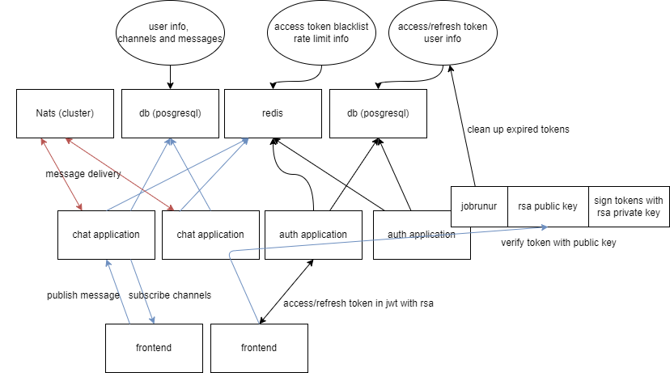
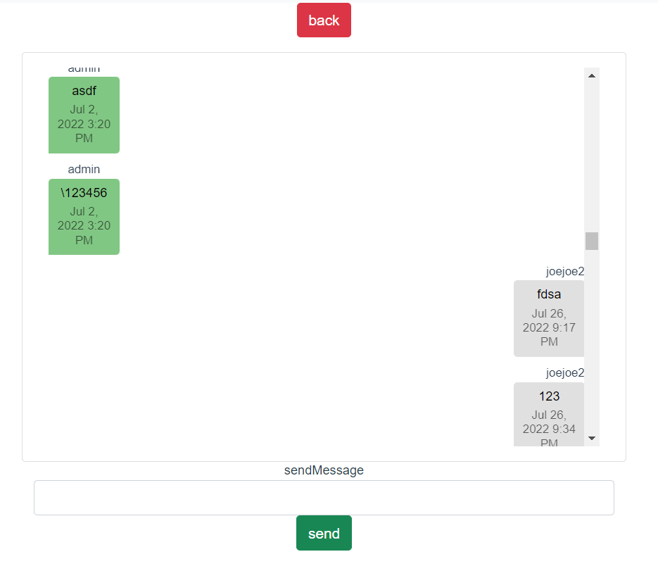
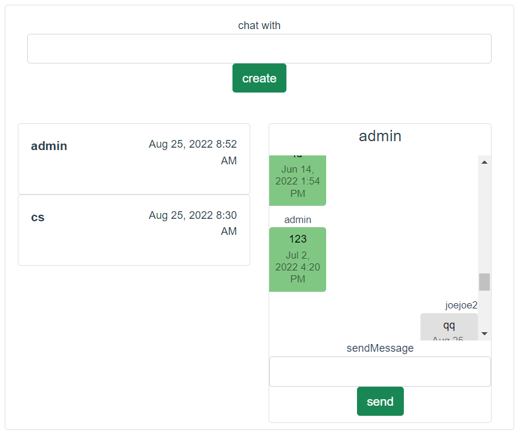

# spring-chat

[](https://github.com/joejoe2/spring-chat/actions/workflows/main.yml)

## Description

This is a horizontal scalable chat application using [Nats](https://github.com/nats-io/nats-server) as event bus.
You can add as many application instances as you need to increase the capacity of
online users in overall system. If you have even more users you can add Nats
servers as cluster to increase the message delivery speed/throughput.

## Features

- chat in public channels with any users
- chat in private channels with another user

## Supported Protocols

You can use below protocols to receive/subscribe chat messages from the server:

- Server Sent Event
- Websocket

## Notice

This project is using [our another project](https://github.com/joejoe2/spring-jwt-template)
as authentication service for JWT authentication.

## Architecture



## Online demo

[https://frontend.joejoe2.com](https://frontend.joejoe2.com)

## Example Frontend

We provide an example frontend application written in Vue.js [at here](https://github.com/joejoe2/frontend/tree/chat) to
work with this project.

- chat in public channel
  
- chat in private channel
  

## Testing

run `mvn test` or `./mvnw test`

## Lint

run
```
mvn spotless:check
mvn spotless:apply
``` 
or
```
./mvnw spotless:check
./mvnw spotless:apply
``` 

## Deploy

1. follow [this](https://github.com/joejoe2/spring-jwt-template#deploy)
   to setup

2. copy `./env/application-chat.env.example` to `./env/application-chat.env`
   and set `jwt.secret.publicKey` as in 1.

3. prepare 2 FQDNs (ex. `chat.test.com`, `auth.test.com`)

4. open `./nginx/user_conf.d/server.conf` to
   replace `chat.example.com` and `auth.example.com` with your 2 FQDNs

5. `docker-compose up` or `docker-compose up -d`